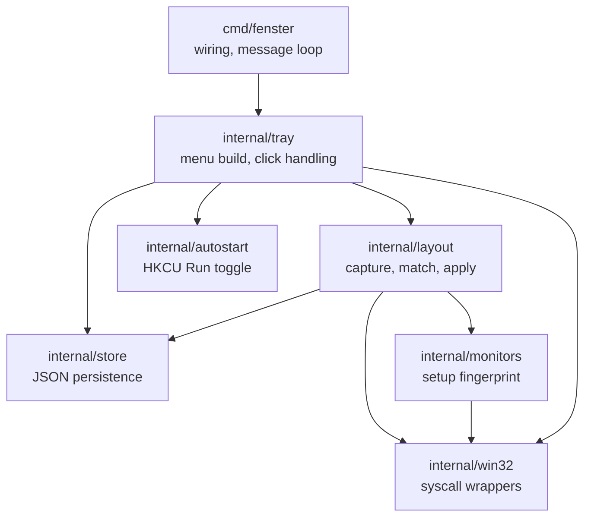

# fenster — Save and Restore Window Layouts

Design document, 2026-09-18.

## Purpose

A Windows tray application in Go that saves the current arrangement of open
windows as a named layout and restores it later. Layouts are offered filtered
by the monitor setup they were saved on, so a docked three-monitor arrangement
is not proposed while working on the laptop alone.

## Scope

In scope for v1:

- Capture all relevant visible top-level windows as a named layout.
- Restore a layout completely, or restore a per-window subset.
- Filter the offered layouts by the current monitor setup.
- Tray icon with a popup menu as the only interface.
- Autostart toggle.

Explicitly out of scope for v1: launching applications that are not running,
global hotkeys, automatic restore on monitor change, virtual desktop
assignment, z-order and focus restoration.

## Constraints

- **No third-party modules.** `proxy.golang.org` is unreachable from the target
  machine and no internal Go proxy is available. Standard library only; all
  Win32 access through `syscall.NewLazyDLL`.
- Windows only. Developed against Windows 11, Go 1.22.
- UI strings are German. Code, comments, commits and documentation are English.

## Architecture

Single binary `fenster.exe`, built with `-H=windowsgui`.



### Packages

| Package | Responsibility | Depends on |
|---|---|---|
| `cmd/fenster` | Process entry, single-instance guard, wiring, Win32 message loop | all |
| `internal/win32` | Typed wrappers over user32/shcore/kernel32/shell32. The only package using `unsafe` | — |
| `internal/layout` | Domain logic: snapshot, match, apply, clamp | `win32` (via interface), `monitors` |
| `internal/monitors` | Monitor setup discovery and fingerprinting | `win32` (via interface) |
| `internal/store` | Load, save, atomic write, corruption recovery | — |
| `internal/tray` | Menu construction, click dispatch, notifications, dialogs | all |
| `internal/autostart` | Read and toggle the HKCU Run entry | — |

`internal/layout` and `internal/monitors` receive their data through a
`Desktop` interface (`Windows() []Window`, `Monitors() []Monitor`), so their
logic is testable with fabricated data on any machine.

`internal/autostart` is the one deliberate exception to `internal/win32`
being the only package that touches the Windows API: `golang.org/x/sys`,
which is where the standard registry package would come from, is
unavailable under the no-third-party-modules constraint, and the four
`advapi32` calls autostart needs (`RegOpenKeyExW`/`RegCreateKeyExW`/
`RegSetValueExW`/`RegDeleteValueW`) are self-contained enough that routing
them through `win32` would add an indirection with nothing shared to show
for it. See the Autostart section below for the calls themselves.

## Data model

Stored at `%APPDATA%\fenster\layouts.json`, pretty-printed, written atomically
via temp file plus rename.

```json
{
  "version": 1,
  "layouts": [{
    "id": "l7x3k9",
    "name": "Docked, dev",
    "created": "2026-09-18T13:40:00+02:00",
    "updated": "2026-09-18T13:40:00+02:00",
    "setup": {
      "fingerprint": "a3f19c02",
      "label": "2 Monitore · 5120×1440 + 1710×1073",
      "monitors": [
        {"x": -1747, "y": -1440, "w": 5120, "h": 1440, "scale": 100, "primary": false},
        {"x": 0, "y": 0, "w": 1710, "h": 1073, "scale": 150, "primary": true}
      ]
    },
    "windows": [{
      "exe": "C:\\Users\\x\\AppData\\Local\\Programs\\Microsoft VS Code\\Code.exe",
      "class": "Chrome_WidgetWin_1",
      "title": "fenster - Visual Studio Code",
      "ordinal": 0,
      "rect": {"x": 227, "y": -682, "w": 1129, "h": 635},
      "screen": {"x": 227, "y": -682, "w": 1129, "h": 635},
      "state": "normal",
      "topmost": false,
      "include": true
    }]
  }]
}
```

Field notes:

- `ordinal` — the n-th window of that executable at save time; last-resort
  matching key.
- `rect` — the *restored* rectangle (from `WINDOWPLACEMENT.rcNormalPosition`),
  in physical pixels, even for a window that was maximized at save time.
- `screen` — the rectangle the window actually occupied on screen at save
  time (`GetWindowRect`), in physical pixels. Added alongside `rect` to fix
  windows snapped via Windows Snap (Win+arrow, Snap Layouts): Windows
  deliberately keeps `rcNormalPosition` as the *pre-snap* rectangle while
  `showCmd` still reads `SW_SHOWNORMAL`, so `rect` alone restores a snapped
  window at its pre-snap size and position instead of where it visibly was.
  For an ordinary, non-snapped window `screen` equals `rect`. A zero or
  non-positive `screen` (including the zero value decoded from a
  `layouts.json` written before this field existed) means "absent, behave
  as before": restore purely from `rect`. This did **not** bump
  `version` — a file without `screen` decodes with a zero value, and a
  file with `screen` decodes fine on a binary that predates the field (the
  unknown key is ignored) — so the change is both backward and forward
  compatible.
- `state` — one of `normal`, `minimized`, `maximized`. `screen` is only used
  for `normal`; `minimized` and `maximized` always restore from `rect`,
  since a minimized window's `GetWindowRect` is the meaningless off-screen
  `(-32000, -32000)` Windows reports for any minimized window.
- `include` — persisted checkbox state, see "Selection model".
- `version` — schema version; a file with a higher version than the binary
  understands is refused rather than rewritten.

**Known limitation:** Windows exposes no public API to put a restored
window back into a snap *group*. Applying `screen` puts the window on the
correct area of the desktop, but Windows will not treat it as snapped
afterwards — neighbouring windows will not resize together with it the way
real snap-group members do. This is accepted as out of scope; in particular,
synthesizing Win+arrow keystrokes to re-invoke Windows' own snap engine is
deliberately not attempted.

## Monitor setup fingerprint

Matching is **loose and geometry-only**: device names, adapter IDs and
connection order are not part of the fingerprint, so replacing a monitor with
an identical model keeps layouts matching.

Computation:

1. Enumerate monitors via `EnumDisplayMonitors` + `GetMonitorInfoW`, read each
   monitor's scaling via `GetDpiForMonitor`.
2. Translate all coordinates so the primary monitor's top-left is the origin.
3. Sort by `(y, x)`.
4. Render each monitor as `WxH+X+Y@scale`, prefixing the primary with `*`.
5. Join with `;` and take the first 8 hex characters of the SHA-256 digest.

A readable `label` is stored alongside for menu display.

Consequence accepted by the user: two physically different setups with
identical geometry share a fingerprint and therefore share layouts.

## Window capture

A window is captured when all of the following hold:

- `IsWindowVisible` is true and it is not cloaked
  (`DwmGetWindowAttribute` / `DWMWA_CLOAKED` returns 0) — this excludes the
  ghost UWP windows that `EnumWindows` otherwise reports.
- It has a non-empty title.
- It does not have `WS_EX_TOOLWINDOW`.
- Its class is not a shell window (`Progman`, `WorkerW`, `Shell_TrayWnd`,
  `Button`).
- It does not belong to our own process.

For each captured window: full executable path via
`GetWindowThreadProcessId` + `QueryFullProcessImageNameW`, window class,
title, `GetWindowPlacement`, and the `WS_EX_TOPMOST` flag.

The process declares `SetProcessDpiAwarenessContext(PER_MONITOR_AWARE_V2)` at
startup, so all coordinates are physical pixels and are consistent between
save and restore.

## Selection model

A Win32 popup menu closes on every click, including on a checkable item, so a
checkmark cannot represent a transient per-restore selection. Instead:

- The checkmark is **persisted state** (`include`) on the window entry.
- Toggling writes the layout back to disk and reopens the menu at the same
  cursor position.
- Restoring a layout applies all entries that are `include: true` **and**
  currently matchable.

## Restore algorithm

1. Snapshot the live desktop.
2. Match each saved entry, in save order, against the live windows. Each live
   window is consumed at most once. Three passes, each running over all
   still-unmatched entries before the next begins:
   1. Same executable path and exact title.
   2. Same executable path and similar title: compare case-insensitively after
      stripping leading modification markers (`●`, `*`, `◐`, whitespace) and a
      trailing ` - <AppName>` / ` — <AppName>` suffix; score candidates by
      normalized Levenshtein similarity (`1 - distance/maxLen`) and accept the
      best one at or above `0.6`. The threshold is a package constant so it can
      be tuned against real titles.
   3. Same executable path, matched by `ordinal` among the remainder.
3. For each match, clamp both `rect` and, when present and valid, `screen`
   independently: if either rectangle lies entirely outside the current
   virtual screen, shift it onto the nearest monitor's work area (relevant
   when restoring a layout from a foreign setup). An absent `screen` is left
   untouched rather than clamped, since there is nothing real to clamp.
4. Apply: `SetWindowPlacement` with the stored normal rectangle (`rect`) and
   the stored show command, then, for a normal-state window only,
   `SetWindowPos` to `screen` when present and valid (falling back to `rect`
   otherwise), then `SetWindowPos` with `HWND_TOPMOST` / `HWND_NOTOPMOST` for
   the always-on-top flag.
5. Report the outcome in one tray balloon:
   `7 Fenster wiederhergestellt, 2 übersprungen (nicht offen)`.

## Tray menu

```
Aktuelles Layout speichern…
──────────────
<Layout matching current setup>        → restore included + present windows
  ├ Alle wiederherstellen
  ├ ─────────
  ├ ✓ Code.exe — fenster - Visual Studio Code
  ├ ✓ msedge.exe — SPOT – Home
  ├   OUTLOOK.EXE — Posteingang (nicht offen)      [greyed out]
  ├ ─────────
  ├ Mit aktuellem Stand überschreiben
  ├ Umbenennen…
  └ Löschen
<further matching layouts>
──────────────
Andere Setups ▸
  └ <layout name> (2 Monitore · 3840×2160 + 1920×1080) ▸  → same submenu shape
──────────────
✓ Mit Windows starten
Speicherort öffnen
Beenden
```

- Only layouts whose fingerprint equals the current one appear at top level.
  Layouts from other setups remain reachable under "Andere Setups", labelled
  with their stored setup label.
- The menu is rebuilt on every open, so greyed-out entries always reflect the
  processes currently running.
- Saving and renaming open a small native modal dialog (a window with an edit
  control and OK/Cancel), prefilled with a suggestion such as
  `2 Monitore · 18.09. 13:40`.
- Deleting asks for confirmation via `MessageBoxW`.

### Tray icon

The standard library cannot embed Win32 resources, and no resource compiler is
assumed to be available. A small `.ico` is embedded with `go:embed`, written to
`%APPDATA%\fenster\fenster.ico` on first run, and loaded with
`LoadImageW(LR_LOADFROMFILE)`. If that fails, the process falls back to the
stock `IDI_APPLICATION` icon so the tray entry always exists.

### Autostart

The standard library has no registry package (`registry` lives in
`golang.org/x/sys`, which is unavailable), so `internal/autostart` calls
`advapi32` directly: `RegOpenKeyExW` / `RegSetValueExW` / `RegDeleteValueW` on
`HKCU\Software\Microsoft\Windows\CurrentVersion\Run`, value name `fenster`,
data the quoted absolute path of the running executable. The menu checkmark
reflects whether that value currently points at this executable.

## Error handling

- No single failure may remove the tray icon. A window that refuses to move
  (elevated process, protected window) is counted as failed and reported, not
  fatal.
- A `layouts.json` that fails to parse is renamed to
  `layouts.json.broken-<timestamp>` and the application starts with an empty
  store; the rename is reported in a balloon.
- A second instance detects the first via a named mutex, shows a balloon, and
  exits.
- Diagnostics are appended to `%APPDATA%\fenster\fenster.log`.

## Testing

- **Unit tests, no desktop required** — matching passes (including title churn
  and duplicate distribution), fingerprint computation and stability, off-screen
  clamping, store round-trip, atomic write, corruption recovery, name
  suggestion. Table-driven, against the `Desktop` interface with fabricated
  windows and monitors. This covers the bulk of the logic.
- **Integration test behind the `win32integration` build tag** — creates a real
  hidden window, applies a placement, reads it back, and asserts the rectangle,
  proving the syscall wrappers are honest.
- **Manual verification** — the tray menu, dialogs, balloons and autostart
  toggle.

Development follows TDD: a failing test before each unit of behaviour.

## Build and delivery

```
go build -ldflags="-H=windowsgui -s -w" -o fenster.exe ./cmd/fenster
```

One static executable, no installer, no runtime dependencies. A `README.md` at
the repository root explains purpose, usage, the menu, the storage location and
the fingerprint semantics, and is kept current as the implementation proceeds.
Each implementation step is committed separately.
